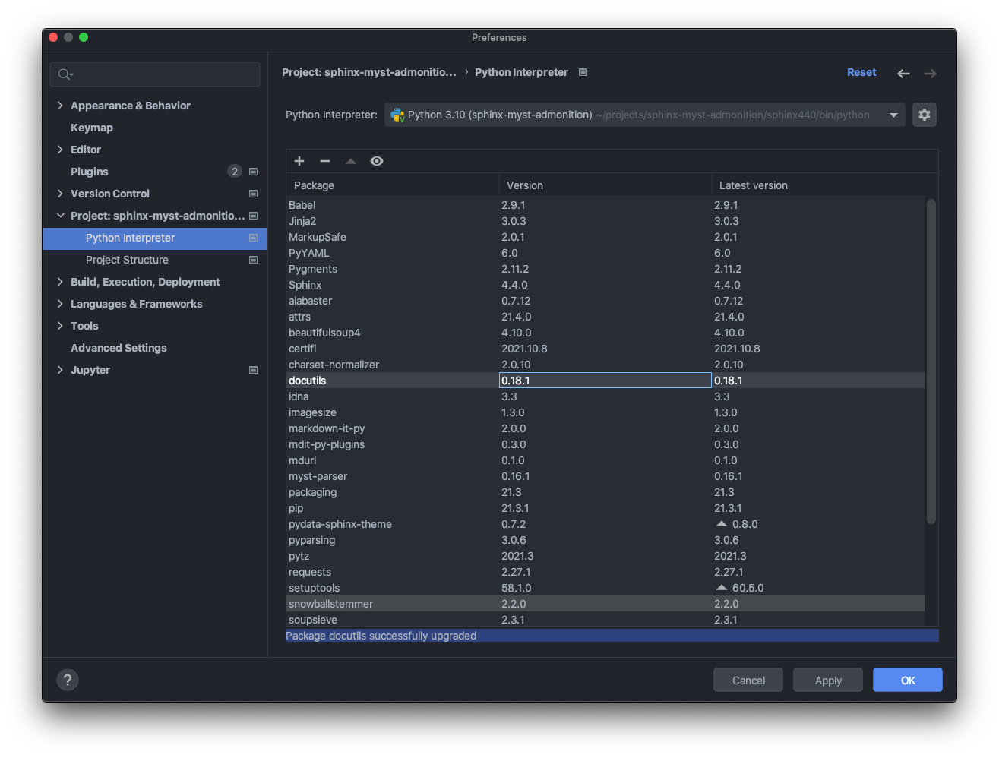
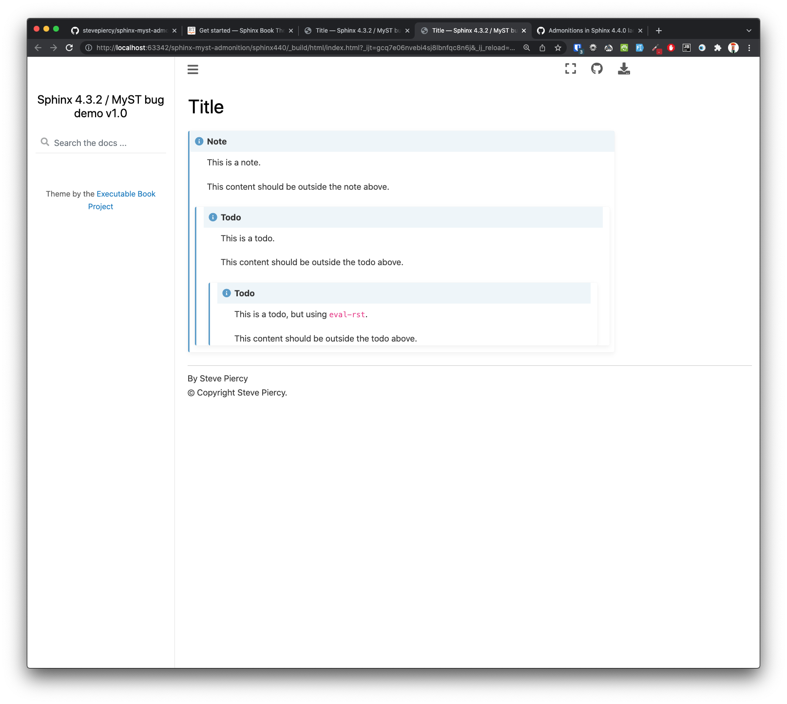

# sphinx-myst-admonition

This project demonstrates a bug where admonitions do not have a closing `<div>`, resulting in nesting of subsequent content inside the admonition that should be outside of it.

See https://github.com/sphinx-doc/sphinx/issues/10121 for details.

## Installation

Open two terminal sessions, and issue the following commands to create a Python virtual environment, update packaging tools, install requirements, activate the environment and build the docs.

Session 432

```shell
cd sphinx432
make build
source bin/activate
make html
```

Session 440

```shell
cd sphinx440
make build
source bin/activate
make html
```

Finally open the built documentation in `_build` to compare.


## Bug demonstration

PyCharm allows a developer to bypass pip's dependency resolver.

Go to `Preferences > Project > Python Interpreter`, and select the Python interpreter in the Sphinx 440 project.

Upgrade docutils from 16.0 to the 18.1.



Build the documentation.

```shell
make html
```

Now compare results.


